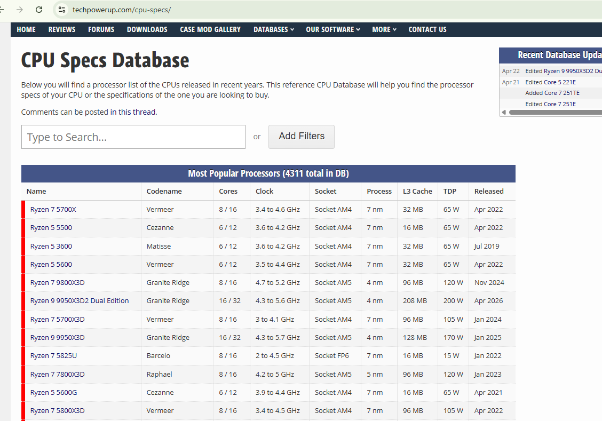

## Choosing the Right CPU

The website TechPowerUp is a valuable resource for anyone looking to better understand processors and compare different CPU models. Whether you are a student, IT professional, developer, or part of a company making hardware decisions, having access to reliable technical data is essential.

The CPU is one of the most important components of a computer, as it directly affects overall system performance. Tasks such as gaming, software development, data processing, and business operations all depend heavily on the processor’s capabilities.

TechPowerUp provides detailed technical specifications for a wide range of CPUs, including information such as architecture, core and thread count, clock speeds, cache, power consumption, and supported technologies. This allows users to make clear and informed comparisons between different processors.

Using platforms like TechPowerUp helps ensure better decision-making when selecting hardware. Choosing the right CPU can lead to improved performance, increased productivity, and more efficient use of resources over time.

For anyone studying IT or working with computers, learning how to analyze and compare CPUs using tools like this is an important and practical skill.

