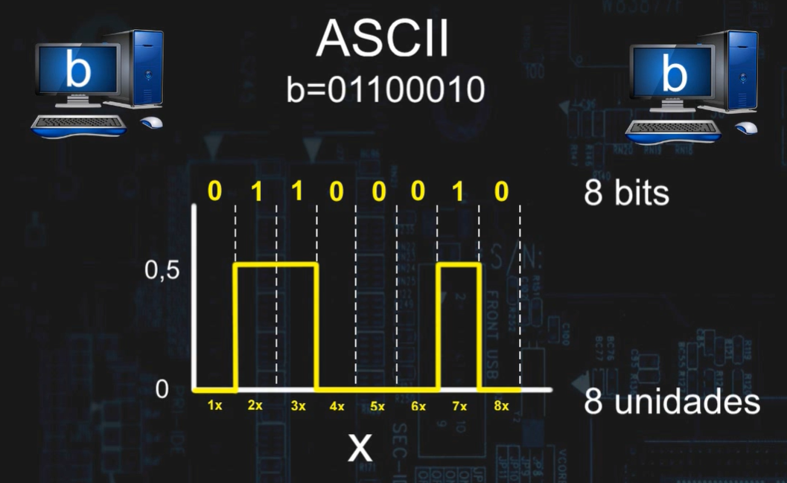

# Bits

## Definition
A bit (binary digit) is the smallest unit of data in a computer. It can have only two values: 0 or 1.

## How it works
Computers use bits to represent and process all types of data, including numbers, text, and images.

Bits are combined to form larger units:
- 8 bits = 1 byte
- 1024 bytes = 1 kilobyte (KB)

## Why it matters
Bits are the foundation of all digital systems. Every operation in a computer is based on binary data (0 and 1).

## Example
- 1 bit → 0 or 1
- 8 bits → can represent 256 different values

## Storage Units (Prefixes)

In data measurement, letters represent quantities:

- K (Kilo) = thousand (1,000)  
- M (Mega) = million (1,000,000)  
- G (Giga) = billion (1,000,000,000)  
- T (Tera) = trillion (1,000,000,000,000)  

# Analogy

Data transmission from one computer to another can be understood as an electrical signal that varies over time. In this analogy, **0 volts represents bit 0 (low signal)** and **0.5 volts represents bit 1 (high signal)**.

The line in the image illustrates this behavior: when it rises, it represents **1**; when it falls, it represents **0**. The sequence of these signals forms the data.

When **8 signals (0s and 1s)** are sent, they form **1 byte**, which can represent a character, such as the letter **"b"** in ASCII code.

*Note: this is a simplified analogy to facilitate understanding.*

## Key Point
All data in a computer is ultimately represented using bits.
