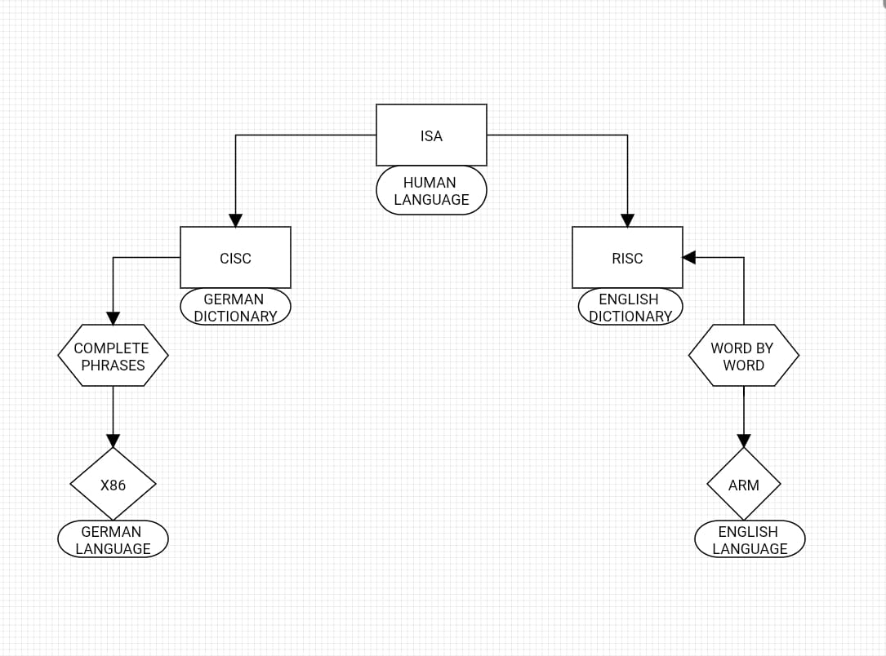

# CISC and RISC

This file presents the two main types of ISA (Instruction Set Architecture): CISC and RISC.

## CISC – Complex Instruction Set Computer

- Complex instruction set capable of performing multiple operations per command.
- Typically has longer and more varied instructions.
- Fewer instructions needed to perform complex tasks.
- More demanding in terms of hardware and memory.
- Processor examples: Intel x86, AMD x86.

## RISC – Reduced Instruction Set Computer

- Reduced instruction set focused on simple and fast operations.
- Each instruction performs a single operation.
- More instructions per program, but execution is fast and predictable.
- More efficient in terms of pipeline and overall performance.
- Processor examples: ARM in smartphones, MIPS.

## Quick Comparison

| Feature               | CISC                       | RISC                       |
|-----------------------|----------------------------|----------------------------|
| Instruction Complexity | High                       | Low                        |
| Number of Instructions| Fewer                      | More                       |
| Execution Speed       | Slower per instruction     | Faster per instruction     |
| Processor Examples    | Intel, AMD                 | ARM, MIPS                  |

# An Easy Explanation of How This Works

ISA (Instruction Set Architecture) is the “language” that the processor understands. It defines the instructions that can be used.

x86 is a specific example of this language, like “German” within the world of processor languages. 

CISC (Complex Instruction Set Computer) is the way x86 is spoken, that is, the style of building and executing these instructions — with more complex commands capable of doing multiple things in a single instruction.

# My Project

This project presents a visual flowchart illustrating CPU architecture using a language analogy:

- **ISA** represents **human language**, defining what can be communicated.  
- **CISC** is like a **German dictionary with grammar rules**, using **complete sentences** to execute instructions.  
- **RISC** represents an **English dictionary**, providing the set of words available to construct instructions.  
- **x86** and **ARM** are **ready-to-use languages** built on top of these dictionaries, representing fully functional instruction sets.

The project applies “language filters”: **German (CISC) uses full sentences**, while **English (RISC) uses individual words**, showing different ways instructions can be structured and executed.

