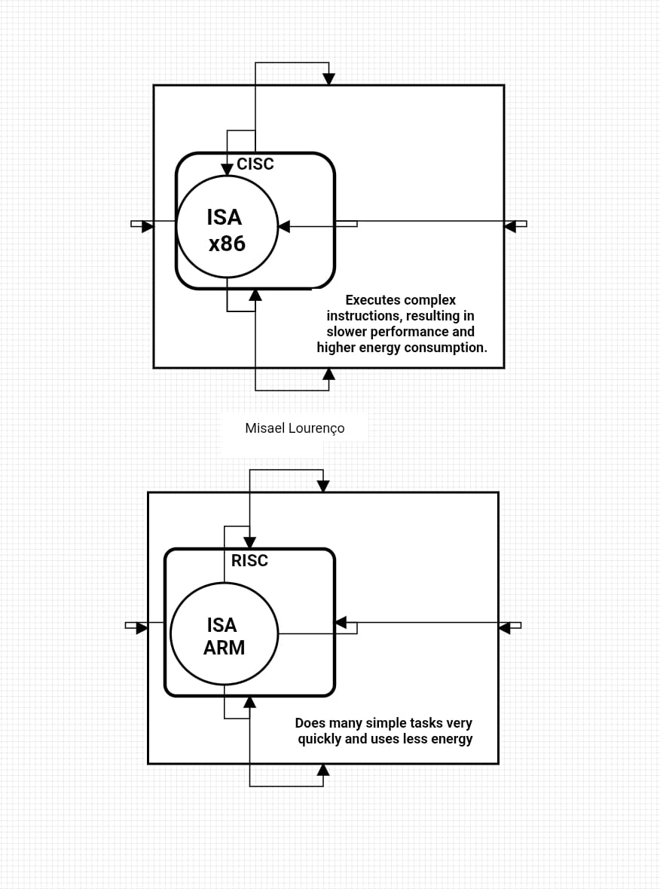

## CISC vs RISC

### Overview

CISC and RISC are **design philosophies** used when creating an Instruction Set Architecture (ISA).  
They define **how instructions are structured and executed**, not the CPU itself.

---

### CISC (Complex Instruction Set Computing)

- Focuses on **more complex instructions**
- A single instruction can perform **multiple operations**
- Reduces the number of instructions per program
- May require **more clock cycles per instruction**
- Example: x86

**Key Idea:**
Do more work with fewer instructions.

---

### RISC (Reduced Instruction Set Computing)

- Focuses on **simpler and more uniform instructions**
- Each instruction typically performs **one operation**
- Requires **more instructions per program**
- Usually executes instructions **faster and more efficiently**
- Example: ARM

**Key Idea:**
Do less per instruction, but execute them faster.

---

### Important Notes

- CISC and RISC are **not ISAs**
- They are **design approaches used to create ISAs**
- Modern processors may internally translate instructions into simpler operations, regardless of whether they follow CISC or RISC principles

---

### Examples

- x86 → ISA designed with CISC principles  
- ARM → ISA designed with RISC principles  

## Simple analogy

This flowchart was created to provide a clearer and more intuitive representation of CPU architecture concepts.

In this model, **ISA** defines what instructions a processor can execute. **CISC (x86)** is represented as an approach that uses more complex and complete instructions, while **RISC (ARM)** focuses on simpler and more efficient instructions executed in greater quantity.

The purpose of this diagram is to improve understanding by visually demonstrating how these different instruction design approaches work, making complex concepts easier to interpret.

---

### Summary

- ISA defines **what instructions a CPU can execute**
- CISC and RISC define **how those instructions are designed**
- Both approaches aim to optimize performance in different ways