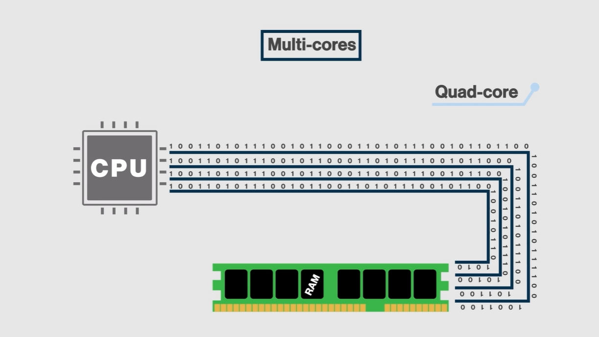

# CPU Cores

## Definition
A core is a processing unit inside the CPU. Each core can execute instructions independently.

## How it works
Modern processors have multiple cores, allowing them to run multiple tasks at the same time.

Example:
- A single-core processor executes one task at a time  
- A multi-core processor executes multiple tasks simultaneously  

## Example Analogy (Multi-core)

This image illustrates the concept of multiple cores.

The lines represent the flow of data between the CPU and memory (RAM), like paths through which information travels.

It is an analogy to show how different tasks can be processed at the same time.

## Important Note
This is a simplified representation.

In practice:
- Cores share internal resources  
- Memory access is managed internally  
- The architecture is more complex than the image suggests  

## Cores and Performance
More cores improve:
- Multitasking  
- System performance  
- Execution of heavy tasks  

However, performance also depends on processor frequency (GHz).

## Key Point
More cores improve multitasking, but ideal performance depends on a balance between cores and clock speed (GHz).

*Image used for educational purposes*  by- Dakota Snow