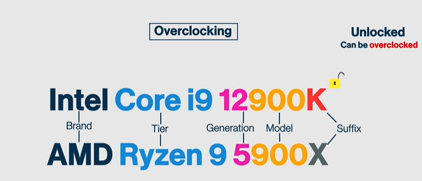

## CPU Generation and Architecture

Understanding CPU generation and architecture is essential when selecting or comparing processors.

CPU architecture refers to the design and technology behind the processor. It defines how the CPU operates, how instructions are processed, and how efficiently it performs tasks. Examples include different architectures developed over time to improve performance, power efficiency, and processing capabilities.

CPU generation represents the evolution of a processor family. Each new generation typically brings improvements such as higher performance, better energy efficiency, enhanced security features, and support for newer technologies like faster memory and connectivity standards.

For example, newer generations often include:
- Improved instruction sets
- Higher core and thread counts
- Better thermal and power management
- Enhanced integrated graphics (in some models)

Understanding the difference between architecture and generation helps users make better decisions when choosing a CPU. A newer generation does not always mean the best choice for every scenario, but it often provides meaningful improvements over previous versions.

Whether for gaming, development, or business use, analyzing CPU architecture and generation is a key step in selecting the right processor.

